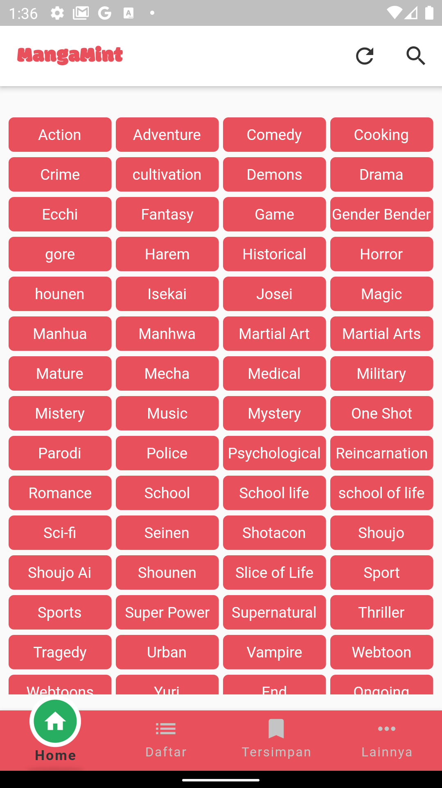
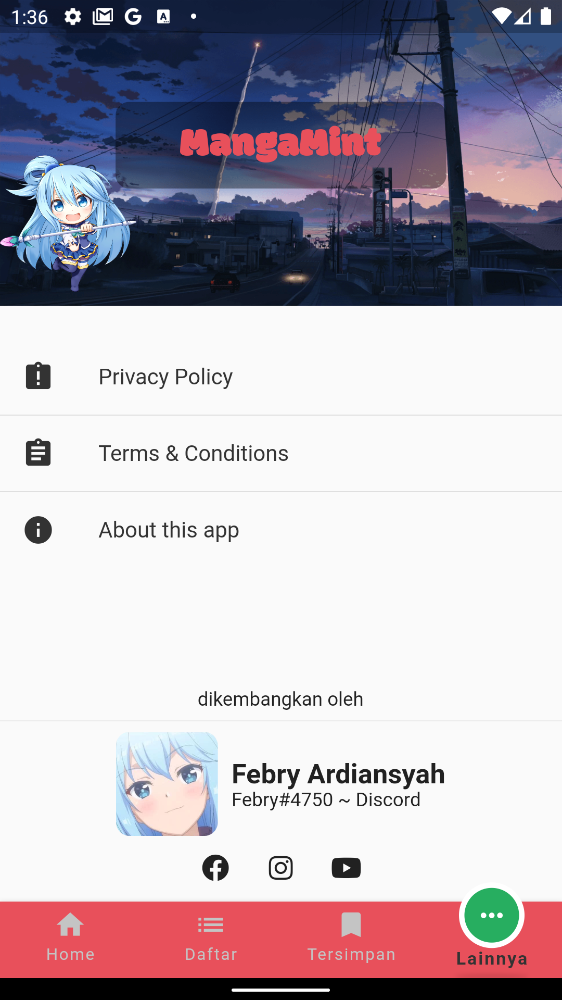
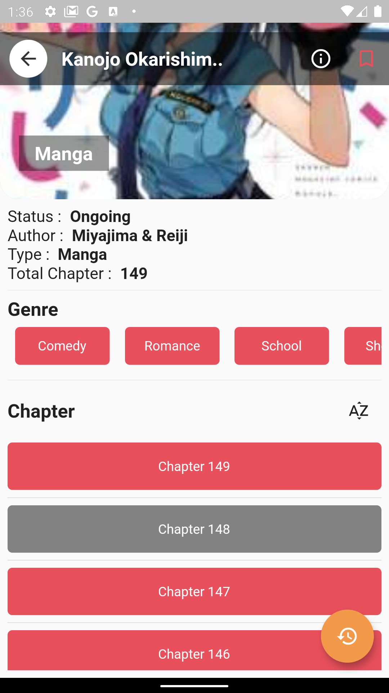

# MangaMint

<p align="center">


 


</p>

MangaMint is manga reader application that provides manga and comic bahasa indonesia and currently
available on android only, idk in the future will be available on ios or not

## Api that i use on this Project
[manga-api](https://github.com/febryardiansyah/manga-api)

## Prototype of This App
[MangaMint Protyotype](https://www.figma.com/proto/tEwOEwAIycAuWfMOCffG3w/customDesign?node-id=591%3A3&scaling=scale-down)

## Download Apk
[mangamint.apk](https://github.com/febryardiansyah/manga_mint/releases/tag/v.1.0)

## Features
- [x] Manga List (Japanase Comic)
- [x] Manhua List (Chinese Comic)
- [x] Manhwa List (Korean Comic)
- [x] Last chapter update
- [x] Bookmarks Manga
- [x] Read last chapter opened
- [x] Search Manga by name and Genres
- [x] Read chapter vertically or horizontally

## Screenshot
 
 
 
 

## Build Setup
``` bash

# install dependencies
$ flutter pub get

# run debug mode
$ flutter run

# run release mode
$ flutter run --release

# build app bundle
$ flutter build appbundle

# build apk
$ flutter build apk

```

For detailed explanation on how things work, check out [Flutter docs](https://flutter.dev/docs).

